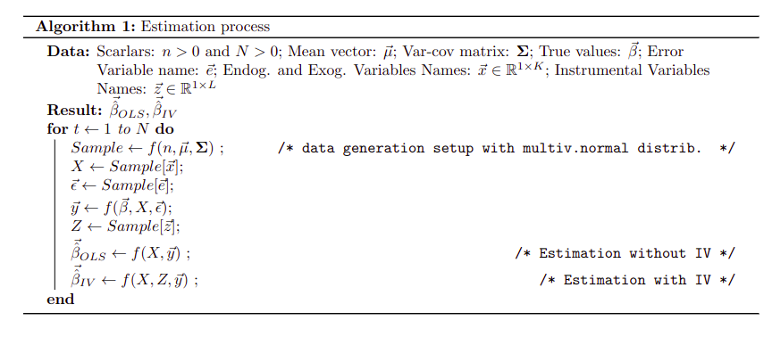

# Econometrics Seminar: Endogeneity

In the framework of linear regression, the exogeneity assumption plays an important role because it states that the residuals are not related to the regressors and, therefore, allows us to make accurate inferences about the parameters. In other words, this assumption is one of the strongest because it states that the variable of interest is uniquely explained by a set of regressors. However, this assumption is often not satisfied in practice and therefore produces problems in the estimation of the parameters. This type of problem in the field of linear regression is known as endogeneity.

The endogeneity problem occurs when one or some of the regressors are correlated with the error term and leads to a biased estimation of the estimators and also affects the statistical inference of the model. In models where the inference of the estimators is essential, this problem does not allow conclusions to be drawn about the causal relationships between the variables used.

As mentioned above, endogeneity causes biased estimators, and in addition to that this problem produces inefficient standard errors and erroneous hypothesis testing. If this problem is not mitigated, it can lead to misleading conclusions and this would lead to inadequate decision making. This is why some methods have been developed to tackle this problem.

One of the methods proposed to address the endogeneity problem is the instrumental variables (IV) method. This approach is characterized by the use of external variables, which are called instruments, that have some characteristics such as that they must be correlated with the endogenous variables and that they must not be correlated with the residuals of the model. The instrumental variables allow to extract the exogenous variation of the variables that have endogeneity problems and then use that variation to explain the dependent variable of the model. This process allows to calculate unbiased estimates of the parameters through the external variables known as instruments.

This paper covers the endogeneity problem in the following sections. In the literature review section some theoretical and applied research papers on this topic are presented, then in the model description section it is explained in detail how the IV method works to combat endogeneity. On the other hand, in the experiments and results section two scenarios are set up and simulations are performed to compare the estimates with and without IV. A more detailed explanation of the simulations is given in this section. And finally, the results of the simulations will be discussed in the conclusion section.

